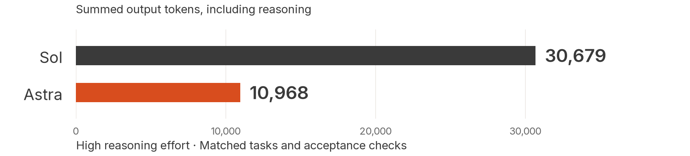

# GPT-6 Astra vs GPT-5.6 Sol: early-access evaluation

By **Teja Juttu, Lead FDE at Eliza** · Measurements collected September 2–3, 2026.

**Promising efficiency on selected reasoning and coding tasks.** The clearest result was 64.2% fewer output tokens on exact constraint reasoning, with six passing runs per model. Smaller Codex coding and reasoning tests, and API long-context tasks, also showed lower output-token usage. The deck presents selected highlights; this repository preserves the complete measurements and checks, including the cases where the pattern differed.

This export uses **`astra-early-access` and `gpt-5.6-sol` as public model labels**; they are not a record of provider routing identifiers. These results are shared in the context of the [GPT-6 Astra launch](https://deploymentsafety.openai.com/gpt-6-astra); they are **early-access measurements, not a retest of the released Astra checkpoint**. This is an exploratory field study, not an official or representative production benchmark.

**Start here:** [8-page PDF](astra-sol-field-evaluation/deck/astra-sol-field-evaluation.pdf) · [Methodology and evidence](astra-sol-field-evaluation/evidence/README.md) · [Exact presentation scope](astra-sol-field-evaluation/evidence/data/presentation-scope.json)



## What stood out

Each row compares the same task and reasoning-effort setting within that experiment. Percentages compare summed output tokens, **including reasoning once**. Rows are separate experiments, not a pooled model ranking.

| Surface / task, high effort | Designs / matched pairs | Sol / Astra passes | Astra output relative to Sol |
|---|---:|---:|---:|
| API: exact constraint reasoning | 3 / 6 | 6/6 · 6/6 | **64.2% fewer** |
| API: long-context tasks | 2 / 4 | 4/4 · 4/4 | 29.0% fewer |
| API: staged repository changes, clean | 3 / 3 | 3/3 · 3/3 | **40.7% more** |
| API: initial technical packets | 14 / 14 | 14/14 · 14/14 | 1.3% fewer |
| API: adapted public coding subset | 16 / 16 | 16/16 · 16/16 | 1.1% more |
| Codex: coding packets | 3 / 3 | 3/3 · 3/3 | 16.2% fewer |
| Codex: reasoning packets | 3 / 3 | 3/3 · 3/3 | 25.8% fewer |

The gains vary by task; the separate response-budget follow-up measured 4.1% fewer output tokens. The complete campaign outcomes, response-cap failures and follow-up configuration remain in the [evidence](astra-sol-field-evaluation/evidence/README.md). These passing-pair comparisons do not establish equal success across the full campaign or production-quality equivalence. Early-access elapsed times depend on the serving setup and do not establish a GA speed ranking; infrastructure is a possible confound, not a verified explanation.

## What the 18.4 million tokens mean

The public presentation covers **364 candidate attempts / 182 pairs: 322 API attempts and 42 Codex assignments**. They account for **17,448,967 input + 970,125 output = 18,419,092 recorded tokens**, across both models. Input includes cached and repeated context. This is usage accounting, not 18.4M generated tokens or a dollar-spend claim.

The presentation excludes 48 historically FDE-labeled attempts to focus on general technical tasks. The full **412-candidate / 206-pair / 68-stratum** ledger retains every recorded measurement and outcome; model labels and record identifiers are normalized for publication. Repeats, effort variants and perturbations are not independent task designs. The [scope file](astra-sol-field-evaluation/evidence/data/presentation-scope.json) specifies the filter, included records and arithmetic.

## Inspect or reproduce

| Evidence | Location |
|---|---|
| Candidate measurements, including outcome and usage fields | [CSV](astra-sol-field-evaluation/evidence/data/candidates.csv) · [JSON](astra-sol-field-evaluation/evidence/data/candidates.json) |
| Pairwise comparisons and all historical strata | [Pairs](astra-sol-field-evaluation/evidence/data/pairs.csv) · [Strata](astra-sol-field-evaluation/evidence/data/strata.csv) |
| Selected prompts, answers, contracts and final code snapshots | [Examples](astra-sol-field-evaluation/evidence/examples) |
| Grader corrections, failures and infrastructure interruptions | [Amendments](astra-sol-field-evaluation/evidence/AMENDMENTS.md) |
| Chart sources and standalone SVG/PNG files | [Charts](astra-sol-field-evaluation/deck/charts) |

After cloning or downloading and extracting this repository, run these commands **from the repository root** with Python 3.10+:

```sh
python3 -B astra-sol-field-evaluation/evidence/recompute.py --check
python3 -B astra-sol-field-evaluation/evidence/verify_examples.py
python3 -B astra-sol-field-evaluation/evidence/verify_package.py
```

These checks use the standard library, make no API calls, and execute no model-generated code. They recalculate the ledger, validate the presentation scope and file hashes, and check selected exact-reasoning answers against independent oracles. The separately documented, optional [staged-code replay](astra-sol-field-evaluation/evidence/README.md#reproduce-the-calculations-locally) executes six final code snapshots under its required macOS sandbox; it does not replay historical model generations or tool sequences.

For immediate viewing on GitHub, open the **PDF**. GitHub displays the [HTML file](astra-sol-field-evaluation/deck/index.html) as source: download or clone the repository, then open `astra-sol-field-evaluation/deck/index.html` locally for the interactive slides. Fonts and graphics are bundled; no hosted Pages site is required.

## How to interpret the comparison

- **API and Codex stay separate.** Codex had different runtime inputs and cache behavior by model. The API repository tasks used a custom tool harness. These experiments do not identify a causal API-versus-Codex effect.
- **Pricing was not established.** The deck and post make output-token claims, with no dollar-cost estimate. Historical common-rate scenarios remain labeled in the evidence; they are not actual Astra charges.
- **Delegation is an observation, not a benchmark result.** The controlled Codex candidates could not spawn subagents, and the API harness exposed no spawning tool. The study does not prove that greater delegation improves outcomes or reduces supervision.
- **Reproducibility has limits.** Complete normalized ledgers and selected synthetic examples are included; full private sessions, provider traces and every original task input are not. Export hashes verify file integrity, not the identity of model weights or provider receipts. Missing usage and unresolved grades remain explicit.

Have you seen a different pattern? Include the task, model/effort, API or Codex environment, success criterion, and whether your measurement includes retries and cached input. That makes comparisons much more useful.
